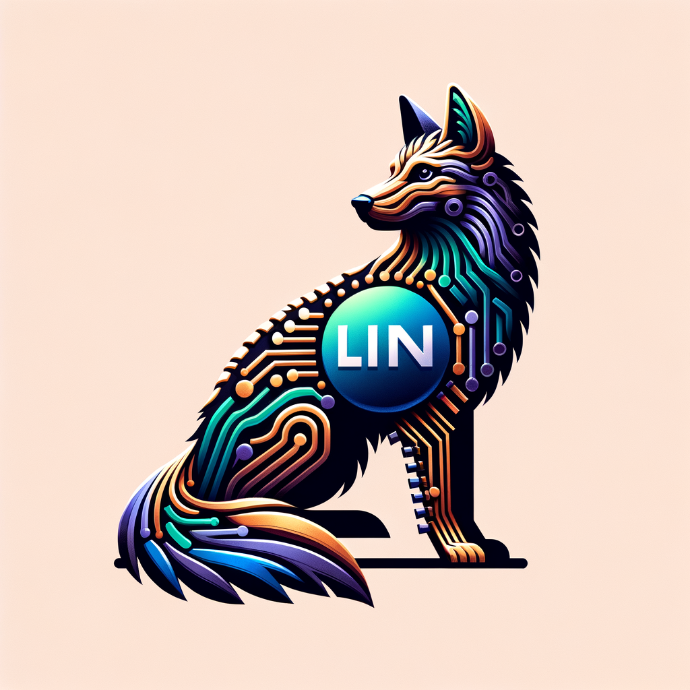
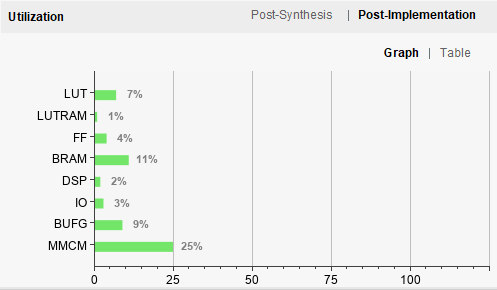
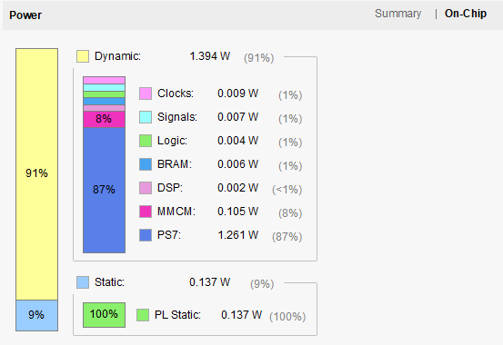

# PicoRV32-on-PYNQ-Z2

This repo is to achieve the picorv32 core on the xilinx PYNQ-Z2 board

<!-- PROJECT SHIELDS -->

[![Contributors][contributors-shield]][contributors-url]
[![Forks][forks-shield]][forks-url]
[![Stargazers][stars-shield]][stars-url]
[![Issues][issues-shield]][issues-url]
[![MIT License][license-shield]][license-url]

<!-- PROJECT LOGO -->
<br />

<p align="center">
  <a href="https://github.com/JacoboJin/RISCV-on-PYNQ-Z2/">
    
  </a>

  <h3 align="center">PicoRV32 on Xilinx PYNQ-Z2</h3>
  <p align="center">
    A "perfect" readme document for you to start the project!
    <br />
    <a href="https://github.com/JacoboJin/RISCV-on-PYNQ-Z2"><strong>Explore the documentation of this project. »</strong></a>
    <br />
    <br />
    <a href="https://github.com/JacoboJin/RISCV-on-PYNQ-Z2">View Demo</a>
    ·
    <a href="https://github.com/JacoboJin/RISCV-on-PYNQ-Z2/issues">Report Bug</a>
    ·
    <a href="https://github.com/JacoboJin/RISCV-on-PYNQ-Z2/issues">Issue</a>
  </p>

</p>

<!-- PROJECT BODY -->
## Contents

- [PicoRV32-on-PYNQ-Z2](#picorv32-on-pynq-z2)
  - [Contents](#contents)
    - [Guide](#guide)
      - [Requirements](#requirements)
      - [Steps](#steps)
    - [File Directory](#file-directory)
    - [Project Summary](#project-summary)
    - [Contributors](#contributors)
    - [Version Control](#version-control)
    - [Author](#author)
    - [License](#license)
    - [Acknowledgements](#acknowledgements)

### Guide

Please replace all ```JacoboJin/RISCV-on-PYNQ-Z2``` with ```your_github_name/your_repository```

#### Requirements

- Vivado 2021.1 on Windows/Linux
- Serial/SSH softwate [(WindTerm)](https://github.com/kingToolbox/WindTerm)
- PYNQ-Z2 Board (For imagefile, We use PYNQ Image 3.0)
- Git [(Windows & Linux Tutorial)](https://www.atlassian.com/git/tutorials/install-git)

#### Steps

1. **Clone the repo**

    ```sh
    git clone https://github.com/JacoboJin/RISCV-on-PYNQ-Z2.git
    ```

2. **Create A BitStream**

    - **Firstly**, you need to create the vivado project for packaging the pico32 core as picorv32_tut ip. (You can follow those operations outlined in the `notebooks/tutorial/2-Creating-A-Bitstream.ipynb` to complete this task).
    - **Secondly**, we have provided an efficient method to complete the overall design by `.tcl` scripts.
      - ```run ./scripts/pico_processor.tcl```
      - ```run ./scirpts/pico_bit.tcl```
      After running the above commands, you must create a wrapper for the design, add constraint files.
    - **Finally**, generate the BitStream file.

    You can get more details to the whole project in the `notebooks/tutorial` Folder. Meanwhile, you can also refer to the original project [RISC-V-On-PYNQ](https://github.com/drichmond/RISC-V-On-PYNQ) 
    ><small>( Due to some errors in the referenced project in terms of details and code, we have made fixes in this project. We have successfully resolved the issues. Therefore, if there are still any problems, please feel free to create an issue for further discussion.)</small>
3. **Compiling the RISC-V GCC Toolchain on your PYNQ Board**
   - connect to the pynq-z2 board by ssh
   - run command

    ```bash
      cd /home/xilinx/riscv-gnu-toolchain
      ./configure --prefix=/opt/riscv32imc --with-arch=rv32imc
      make
    ```

   - Configure the generated `/opt/riscv32imc/bin` into an environment variable `~/.bashrc` by executing the following code in Jupyter Notebooks:

    ```Python
      import os
      path = os.environ['PATH'].split()
      riscv_path = '/opt/riscv32imc/bin'
      if(riscv_path not in path):
          print('Updating /etc/environment file... ',end="")
          !sed -i 's/PATH=\"\(.*\)\"/PATH=\"\/opt\/riscv32imc\/bin:\1\"/' /etc/environment
          print('done')
      else:
          print("/etc/environment file already updated")
    ```

    - reboot PYNQ-Z2

    ```bash
      shutdown -r now
    ```

    - Confirm that the RISC-V toolchain has been successfully installed

    ```bash
      riscv32-unknown-elf-gcc --version
    ```

4. **Packaging an Overlay**

### File Directory

```text
File Tree
├── ARCHITECTURE.md
├── LICENSE
├── README.md
├── /constrs/
│  ├── PYNQ_Z2.xdc
├── /gold_ip/
│  ├── /pcpi_v1_0/
│  ├── /picobram_if/
│  ├── /picobridge/
│  ├── /picorv32_axi/
│  ├── /picorv32_bram/
├── /ip/
│  ├── /pcpi_v1_0/
│  ├── /picobram_if/
│  ├── /picobridge/
│  ├── /picorv32_axi/
│  ├── /picorv32_bram/
│  ├── /picorv32_tut/
├── /notebooks/
│  ├── /examples/
│  ├── /tutorial/
|  │  ├── /pictures/
|  │  ├── 0-How-To-RISC-V.ipynb
|  │  ├── 1-Downloading-And-Configuring.ipynb
|  │  ├── 2-Creating-A-Bitstream.ipynb
|  │  ├── 3-Compiling-RISC-V-GCC-Toolchain.ipynb
|  │  ├── 4-Packaging-An-Overlay.ipynb
├── /picorv32/
├── /ReadMe-deps/
├── /scripts/
│  ├── build.tcl
│  ├── pico_bit.tcl
│  ├── pico_processor.tcl
├── /templates/
├── useless.md
├── LICENSE
├── README.md
└── /util/
```

### Project Summary





### Contributors

Please read **CONTRIBUTING.md** to find the developers who have made contributions to this project.

*Contributions make the open-source community an excellent place for learning, inspiration, and creativity. Any contributions you make are **greatly appreciated**.*

```text
  How to Get Involved in Open Source Projects
  1. Fork the Project
  2. Create your Feature Branch (`git checkout -b feature/AmazingFeature`)
  3. Commit your Changes (`git commit -m 'Add some AmazingFeature'`)
  4. Push to the Branch (`git push origin feature/AmazingFeature`)
  5. Open a Pull Request
```

### Version Control

This project uses Git for version control. You can check the available versions in the repository.

### Author

Jin.ZJ @Shanghai University

 *You can also check the list of contributors to see all the developers involved in this project.*

### License

This project is licensed under the **MIT License**. For details, please refer to the [LICENSE](https://github.com/JacoboJin/RISCV-on-PYNQ-Z2/blob/main/LICENSE) file.

### Acknowledgements

- [GitHub Emoji Cheat Sheet](https://www.webpagefx.com/tools/emoji-cheat-sheet)
- [Img Shields](https://shields.io)
- [Choose an Open Source License](https://choosealicense.com)
- [GitHub Pages](https://pages.github.com)
- [Animate.css](https://daneden.github.io/animate.css)
- [riscv-gnu-toolchain](https://github.com/riscv-collab/riscv-gnu-toolchain)
- [RISC-V-On-PYNQ](https://github.com/drichmond/RISC-V-On-PYNQ)

<!-- links -->
[your-project-path]: JacoboJin/RISCV-on-PYNQ-Z2
[contributors-shield]: https://img.shields.io/github/contributors/JacoboJin/RISCV-on-PYNQ-Z2.svg?style=flat-square
[contributors-url]: https://github.com/JacoboJin/RISCV-on-PYNQ-Z2/graphs/contributors
[forks-shield]: https://img.shields.io/github/forks/JacoboJin/RISCV-on-PYNQ-Z2.svg?style=flat-square
[forks-url]: https://github.com/JacoboJin/RISCV-on-PYNQ-Z2/network/members
[stars-shield]: https://img.shields.io/github/stars/JacoboJin/RISCV-on-PYNQ-Z2.svg?style=flat-square
[stars-url]: https://github.com/JacoboJin/RISCV-on-PYNQ-Z2/stargazers
[issues-shield]: https://img.shields.io/github/issues/JacoboJin/RISCV-on-PYNQ-Z2.svg?style=flat-square
[issues-url]: https://img.shields.io/github/issues/JacoboJin/RISCV-on-PYNQ-Z2.svg
[license-shield]: https://img.shields.io/github/license/JacoboJin/RISCV-on-PYNQ-Z2.svg?style=flat-square
[license-url]: https://github.com/JacoboJin/RISCV-on-PYNQ-Z2/blob/main/LICENSE
  